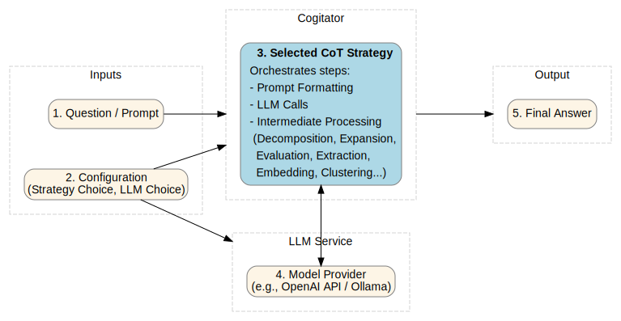

# Cogitator Documentation

## Overview
Cogitator is a Python toolkit for experimenting and working with
[chain-of-thought (CoT) prompting](https://arxiv.org/abs/2201.11903)
methods in large language models (LLMs).
CoT prompting improves LLM performance on complex tasks (like question-answering, reasoning, and problem-solving)
by guiding the models to generate intermediate reasoning steps before arriving at the final answer.
Additionally, it can be used to improve the interpretability of LLMs by providing insight into the model's reasoning process.
The toolkit aims to make it easier to use popular CoT strategies and frameworks for research or integrating them into AI
applications.

### Features

* Provides unified sync/async API for CoT strategies
* Supports using OpenAI and Ollama as LLM providers 
* Easy to extend and add new LLM providers and CoT strategies
* Supports structured model output with Pydantic validation
* Includes a customizable benchmarking framework (see [benches](benches))
* Includes implementations of popular CoT strategies and frameworks like
    - [Self-Consistency CoT (ICLR 2023)](https://arxiv.org/abs/2203.11171)
    - [Automatic CoT (ICLR 2023)](https://arxiv.org/abs/2210.03493)
    - [Least-to-Most Prompting (ICLR 2023)](https://arxiv.org/abs/2205.10625)
    - [Tree of Thoughts (NeurIPS 2023)](https://arxiv.org/abs/2305.10601)
    - [Graph of Thoughts (AAAI 2024)](https://arxiv.org/abs/2308.09687)
    - [Clustered Distance-Weighted CoT (AAAI 2025)](https://arxiv.org/abs/2501.12226)

The diagram below shows a high-level overview of Cogitator's workflow.



## Installation

Cogitator can be installed via pip using the following command:

```bash
pip install cogitator
```

To run the unit tests and benchmarks, development dependencies are needed that can be installed with the following command:

```bash
git clone https://github.com/habedi/cogitator && cd cogitator

# Set up Python environment
pip install poetry
poetry install --with dev

# Run the tests to make sure everything is working (optional)
poetry run pytest
```

## Examples

Check the [examples](https://github.com/habedi/cogitator/blob/main/examples) for usage examples on how to use the library with
different LLM providers and CoT strategies.

## API Reference

The Cogitator library's functionality is organized into several key modules:

* **LLM Providers (`cogitator.model`)**
    * [`BaseLLM`](api/model.md): The abstract base LLM provider class that defines a common interface for all LLM providers.
    * [`OpenAILLM`](api/openai.md): LLM provider implementation for using OpenAI models (like gpt-4o-mini and gpt-4o).
    * [`OllamaLLM`](api/ollama.md): LLM provider implementation for using Ollama models (like Llama, Gemma, and Qwen).

* **CoT Strategies (`cogitator.strategies`)**
    * [`AutoCoT`](api/auto_cot.md): An implementation of the automatic CoT prompting strategy from [this paper](https://arxiv.org/abs/2210.03493).
    * [`CDWCoT`](api/cdw_cot.md): An implementation of the clustered distance-weighted CoT framework from [this paper](https://arxiv.org/abs/2501.12226).
    * [`GraphOfThoughts`](api/graph_of_thoughts.md): An implementation of the graph of thoughts CoT framework from [this paper](https://arxiv.org/abs/2308.09687).
    * [`LeastToMost`](api/least_to_most.md): An implementation of the least-to-most prompting strategy from [this paper](https://arxiv.org/abs/2205.10625).
    * [`SelfConsistency`](api/sc_cot.md): An implementation of the self-consistency prompting strategy from [this paper](https://arxiv.org/abs/2203.11171).
    * [`TreeOfThoughts`](api/tree_of_thoughts.md): An implementation of the tree of thoughts CoT framework from [this paper](https://arxiv.org/abs/2305.10601).

* **Data Formatting and Validation (`cogitator.schemas`)**
    * [`Schemas`](api/schemas.md): A set of Pydantic models that are used for validating structure of outputs from LLMs.

* **Utilities**
    * [`Embedding`](api/embedding.md): A set of tools for embedding prompt text which is used by strategies like AutoCoT and CDWCoT.
    * [`Clustering`](api/clustering.md): Includes clustering algorithms for grouping similar embeddings that is used during the training phase of strategies like AutoCoT and CDWCoT.

## Extra Resources

* **[Benchmarking](benchmarking.md):** Learn how to configure and run the performance evaluation framework.
* **[Contributing](contributing.md):** Find guidelines for contributing to the Cogitator project.

<!-- end list -->
